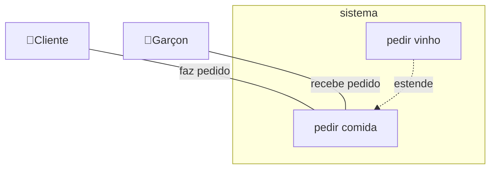
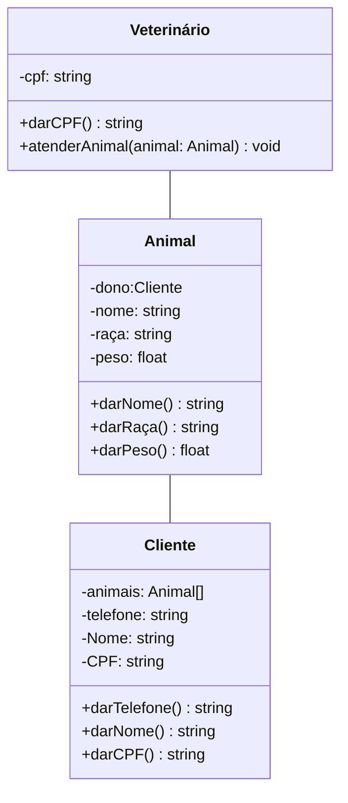

# trabalho-engenharia-software-2026
Trabalho de clínica veterinária do Técnico em Informática, segundo semestre de 2026.

## Diagramas UML

#Diagrama de classe de uso

```mermaid
flowchart TD
    cliente["👲Cliente"]
    garçon["💂Garçon"]

   
%% ações
subgraph sistema
    comida["pedir comida"]
    vinho["pedir vinho"]
    end


%%relacionamentos
    cliente -- "faz pedido" --- comida
    garçon -- "recebe pedido" --- comida

    vinho -. "estende" .-> comida

```

### Diagrama de classes

```mermaid
classDiagram
    class Veterinário{
        %% atributos: caracterisiticas que serão
        %% armazenados no sistema
        -cpf: string
        %% métodos: ações que serão desempenhadas
        %% por essa entidade no sistema
        +darCPF() string
        +atenderAnimal(animal: Animal) void
    }

    Veterinário -- Animal
    Animal -- Cliente
    
    class Animal{
        -dono:Cliente
        -nome: string
        -raça: string
        -peso: float

        +darNome() string
        +darRaça() string
        +darPeso() float

    }

    class Cliente{
        -animais: Animal[]
        -telefone: string
        -Nome: string
        -CPF: string

        +darTelefone() string
        +darNome() string
        +darCPF()string


    }
```
