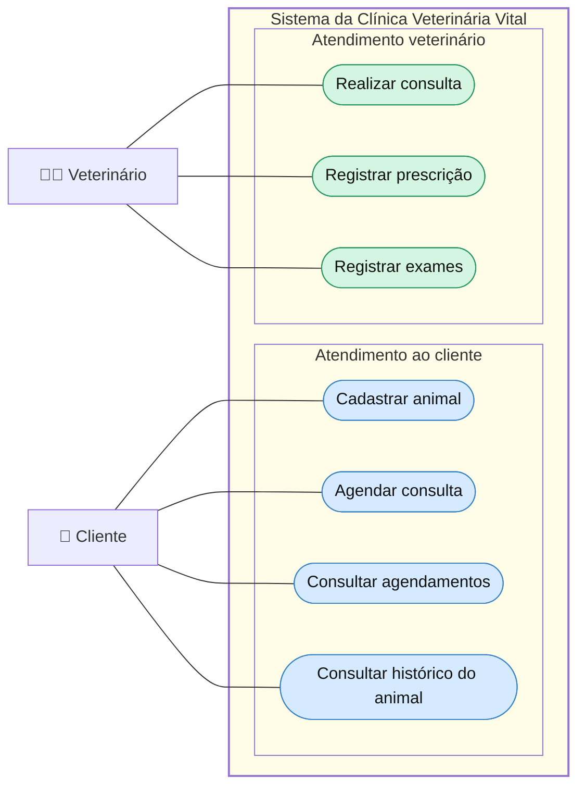
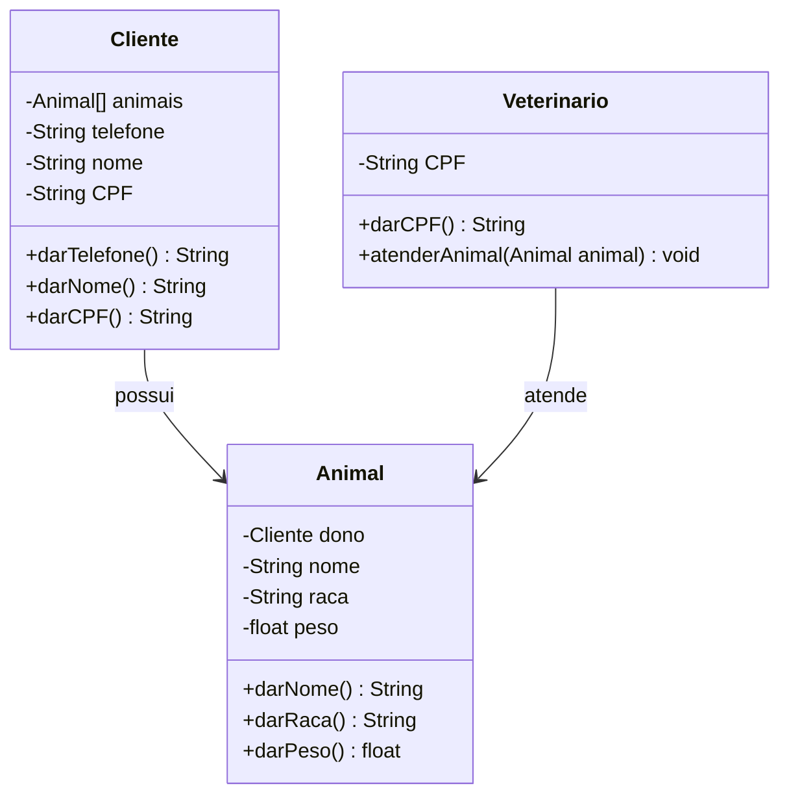

# trabalho-engenharia-software-2026
Trabalho de clínica veterinária do Técnico em Informática, segundo semestre de 2026.

## Diagramas UML

#Diagrama de caso de uso

```mermaid
flowchart LR
    Cliente["👦 Cliente"]
    Veterinario["👨‍🦰 Veterinário"]

    subgraph Sistema["Sistema da Clínica Veterinária Vital"]
        direction TB

        subgraph AtendimentoCliente["Atendimento ao cliente"]
            AT1(["Cadastrar animal"])
            AT2(["Agendar consulta"])
            AT3(["Consultar agendamentos"])
            AT4(["Consultar histórico do animal"])
        end

        subgraph AtendimentoVet["Atendimento veterinário"]
            AT5(["Realizar consulta"])
            AT6(["Registrar prescrição"])
            AT7(["Registrar exames"])
        end
    end

    Cliente --- AT1
    Cliente --- AT2
    Cliente --- AT3
    Cliente --- AT4

    Veterinario --- AT5
    Veterinario --- AT6
    Veterinario --- AT7

    style Sistema fill:#fffde7,stroke:#9575cd,stroke-width:2px
    style AtendimentoCliente fill:#fffde7,stroke:#9575cd
    style AtendimentoVet fill:#fffde7,stroke:#9575cd

    classDef cliente fill:#d6eaff,stroke:#3984c6,color:#111
    classDef veterinario fill:#d5f5e3,stroke:#299764,color:#111

    class AT1,AT2,AT3,AT4 cliente
    class AT5,AT6,AT7 veterinario


```

### Diagrama de classes

```mermaid
classDiagram
    class Veterinario {
        -String CPF
        +darCPF() String
        +atenderAnimal(Animal animal) void
    }

    class Animal {
        -Cliente dono
        -String nome
        -String raca
        -float peso
        +darNome() String
        +darRaca() String
        +darPeso() float
    }

    class Cliente {
        -Animal[] animais
        -String telefone
        -String nome
        -String CPF
        +darTelefone() String
        +darNome() String
        +darCPF() String
    }

    Cliente -->  Animal : possui
    Veterinario -->  Animal : atende

```
